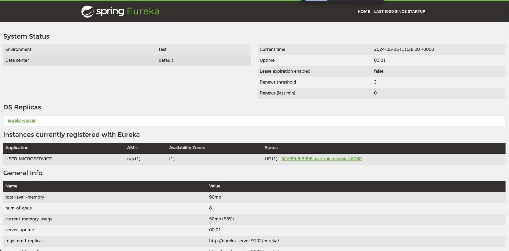

# 🩻 Spring Archi Microservices Template

[](https://github.com/mayel15/node-express-template)

👨🏾‍💻 Pape THIAM [@mayel15](https://github.com/mayel15)

# 🧰 Stack

<a href="https://www.java.com" target="_blank" rel="noreferrer">  </a> <a href="https://docs.spring.io/spring-boot/docs/current/reference/htmlsingle/" target="_blank" rel="noreferrer">  </a> <a href="https://postman.com" target="_blank" rel="noreferrer">  </a> <a href="https://www.postgresql.org" target="_blank" rel="noreferrer">  </a> </a> <a href="https://www.docker.com/" target="_blank" rel="noreferrer">  </a>

## ➕ More

- Cloud Config
- Eureka Server
- APi Gateway

# 📄 Description du projet

This is an opinionated boilerplate (template or skeleton, whatever you want) for SpringBoot architecture oriented microservices. This repository serves as a template to simplify the [creation of new repositories from it](https://docs.github.com/en/repositories/creating-and-managing-repositories/creating-a-repository-from-a-template).

# ⚙️ Clean, Compile, Package

- In the project, a `.jar` file will be generate for each microservices for the builds of docker images

- In case of sources files changements, **compile** and **package** the concerned microservice project with `maven` in order to get the `.jar` file for building new `docker image`

- Highly recommended to do it for each microservice

# 🚀 Run

- Clone the projet

```sh
git clone https://github.com/mayel15/spring-archi-microservices-template.git
```

- Run the microservices with `docker` at the root of the project

```sh
cd spring-archi-microservices-template
```

```sh
docker-compose up -d
```

- Wait until the complete launch of all the microservices present in the `docker-compose`

- Eureka server will run in `localhost` at the port `9102`


